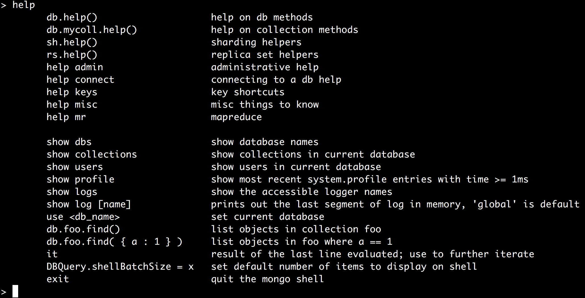

# MongoDB 入门

## 目录
- 简介（几个概念）
  - document
  - collection
  - BSON
  - 对比关系型数据库
- 基本使用
  - 安装与启动
  - Mongo Shell
  - 几个常用的操作符及方法
  - CURD
  - Aggregation
- 数据模型设计


## 简介（几个概念）

> MongoDB is an open-source document database that provides high performance, high availability, and automatic scaling.


#### document（文档）

文档是MongoDB中数据的基本单位。一行纪录就是一个文档，它是一个由键值对构成的数据结构，MongoDB文档与JSON对象类似。键的值可以包含其他的文档，数组，文档数组。


The advantages of using documents are:

- Documents (i.e. objects) correspond to native data types in many programming languages.
- Embedded documents and arrays reduce need for expensive joins.
- Dynamic schema supports fluent polymorphism.(流利的多态性)

#### collection（集合） 

集合中存储文档。集合类似于关系数据库中的表。然而，与表不同的是集合不要求它里面的文档具有相同的结构。


##### BSON

Mongo用于存储文档和远程过程调用的一种二进制序列化格式

[bsonspec.org](http://bsonspec.org/)

#### [关键特性](https://docs.mongodb.com/manual/introduction/#key-features)

- 高性能（嵌入文档的设计减少数据系统的I/O活动，索引支持...）
- 丰富的查询语言（支持CRUD，数据聚合，文本搜索，地理空间查询）
- 高可用（[replica set](https://docs.mongodb.com/manual/replication/)）
- 水平可伸缩性（[Sharding](https://docs.mongodb.com/manual/sharding/#sharding-introduction)）
- 支持多种存储引擎

#### 对比关系型数据库

| SQL术语/概念        | MongoDB术语/概念    | 解释/说明                       |
| --------------- | --------------- | --------------------------- |
| database        | database        | 数据库                         |
| **table**       | **collection**  | **数据库表/集合**                 |
| **row**         | **document**    | **数据记录行/文档**                |
| column          | field           | 字段                          |
| index           | index           | 索引                          |
| table joins     |                 | 表连接,MongoDb不支持              |
| **primary key** | **primary key** | **主键,MongoDb自动将_id字段设置为主键** |

...

## 基本使用

#### [安装与启动](https://docs.mongodb.com/manual/installation/)

**brew安装：**

```
brew install mongodb --with-openssl
```

```
brew info mongodb
```

**启动：**

```
To have launchd start mongodb now and restart at login:
  brew services start mongodb
Or, if you don't want/need a background service you can just run:
  mongod --config /usr/local/etc/mongod.conf
```

#### Mongo Shell

> Mongo命令行是一个跟MongodDB服务交互的JavaScript接口工具，它是MongoDB封装的一个组件。你可以使用这个命令行工具查询，更新数据，执行一些管理操作。

```
mongo
```

```
help
```

```
show dbs
show collections
```



# 几个常用的操作符及方法

[Operators](https://docs.mongodb.com/manual/reference/operator/)

**MongoDB中条件操作符**

- (>) 大于 - $gt
- (<) 小于 - $lt
- (>=) 大于等于 - $gte
- (<= ) 小于等于 - $lte
- != $ne
- $in
- $nin

**MongoDB $type 操作符**

$type操作符是基于BSON类型来检索集合中匹配的数据类型，并返回结果。

| **类型**                  | **数字** | **备注**           |
| ----------------------- | ------ | ---------------- |
| Double                  | 1      |                  |
| String                  | 2      |                  |
| Object                  | 3      |                  |
| Array                   | 4      |                  |
| Binary data             | 5      |                  |
| Undefined               | 6      | 已废弃。             |
| Object id               | 7      |                  |
| Boolean                 | 8      |                  |
| Date                    | 9      |                  |
| Null                    | 10     |                  |
| Regular Expression      | 11     |                  |
| JavaScript              | 13     |                  |
| Symbol                  | 14     |                  |
| JavaScript (with scope) | 15     |                  |
| 32-bit integer          | 16     |                  |
| Timestamp               | 17     |                  |
| 64-bit integer          | 18     |                  |
| Min key                 | 255    | Query with `-1`. |
| Max key                 | 127    |                  |

**MongoDB Limit与Skip方法**

使用MongoDB的Limit方法，limit()方法接受一个数字参数，该参数指定从MongoDB中读取的记录条数。

使用skip()方法来跳过指定数量的数据，skip方法同样接受一个数字参数作为跳过的记录条数。

```
db.col.find({},{"title":1,_id:0}).limit(1).skip(1)
```

**MongoDB sort()方法**

使用sort()方法对数据进行排序，sort()方法可以通过参数指定排序的字段，并使用 1 和 -1 来指定排序的方式，其中 1 为升序排列，而-1是用于降序排列。

```
db.COLLECTION_NAME.find().sort({KEY:1})
```

### CURD

- [`db.collection.insertOne()`](https://docs.mongodb.com/manual/reference/method/db.collection.insertOne/#db.collection.insertOne) 
- [`db.collection.insertMany()`](https://docs.mongodb.com/manual/reference/method/db.collection.insertMany/#db.collection.insertMany)


- [`db.collection.find()`](https://docs.mongodb.com/manual/reference/method/db.collection.find/#db.collection.find)


- [`db.collection.updateOne()`](https://docs.mongodb.com/manual/reference/method/db.collection.updateOne/#db.collection.updateOne) 
- [`db.collection.updateMany()`](https://docs.mongodb.com/manual/reference/method/db.collection.updateMany/#db.collection.updateMany)
- [`db.collection.replaceOne()`](https://docs.mongodb.com/manual/reference/method/db.collection.replaceOne/#db.collection.replaceOne)


- [`db.collection.deleteOne()`](https://docs.mongodb.com/manual/reference/method/db.collection.deleteOne/#db.collection.deleteOne)
- [`db.collection.deleteMany()`](https://docs.mongodb.com/manual/reference/method/db.collection.deleteMany/#db.collection.deleteMany)

**query-documents**

```
db.inventory.find( { status: "D" } )

SELECT * FROM inventory WHERE status = "D"
```

```
db.inventory.find( { status: { $in: [ "A", "D" ] } } )

SELECT * FROM inventory WHERE status in ("A", "D")
```

```
db.inventory.find( { status: "A", qty: { $lt: 30 } } )

SELECT * FROM inventory WHERE status = "A" AND qty < 30
```

```
db.inventory.find( { $or: [ { status: "A" }, { qty: { $lt: 30 } } ] } )

SELECT * FROM inventory WHERE status = "A" OR qty < 30
```

```
db.inventory.find( {
     status: "A",
     $or: [ { qty: { $lt: 30 } }, { item: /^p/ } ] // $regex
} )

SELECT * FROM inventory WHERE status = "A" AND ( qty < 30 OR item LIKE "p%")
```

**query-embedded-documents**

```
{ item: "journal", qty: 25, size: { h: 14, w: 21, uom: "cm" }, status: "A" }
{ item: "journal", qty: 25, size: { h: 14, w: 21, uom: "in" }, status: "A" }

// db.inventory.find( { size: { w: 21, h: 14, uom: "cm" } } ) 
db.inventory.find( { size: { h: 14, w: 21, uom: "cm" } } ) // 顺序

db.inventory.find( { "size.h": 14, "size.w": 21, "size.uom": "cm" } ) // .
db.inventory.find( { "size.w": 21, "size.h": 14, "size.uom": "cm" } ) // 无序

db.inventory.find( { "size.uom": "in" } )

db.inventory.find( { "size.h": { $lt: 15 }, "size.uom": "in", status: "D" } )
```

**query-arrays**

```
{ item: "journal", qty: 25, tags: ["blank", "red"], dim_cm: [ 14, 21 ] }
{ item: "notebook", qty: 50, tags: ["red", "blank"], dim_cm: [ 14, 21 ] }

// db.inventory.find( { tags: ["blank", "red"] } )
db.inventory.find( { tags: ["red", "blank"] } ) // 顺序
db.inventory.find( { "tags.0": "red" } ) 
db.inventory.find( { tags: { $all: ["red", "plain"] } } ) // 对比$in
db.inventory.find( { tags: { $in: ["red", "plain"] } } ) //

db.inventory.find( { tags: "plain" } )

{ <array field>: { <operator1>: <value1>, ... } }
db.inventory.find( { dim_cm: { $gt: 25 } } ) // { $gt: 25 } 只要有一个大于25 返回
db.inventory.find( { dim_cm: { $gt: 15, $lt: 20 } } )//{$gt: 15}{$lt: 20}{$gt: 15,$lt: 20}
db.inventory.find( { dim_cm: { $elemMatch: { $gt: 22, $lt: 30 }}})// { $gt: 22, $lt: 30 } 
db.inventory.find( { "dim_cm.1": { $gt: 25 } } ) // 索引位置的值
db.inventory.find( { "tags": { $size: 3 } } ) // 数组长度
```

**query-array-of-documents**

```
{ item: "journal", instock: [ { warehouse: "A", qty: 5 }, { warehouse: "C", qty: 15 } ] }
{ item: "notebook", instock: [ { warehouse: "C", qty: 5 } ] }

db.inventory.find( { "instock": { warehouse: "A", qty: 5 } } ) // 顺序
db.inventory.find( { "instock": { qty: 5, warehouse: "A" } } )

db.inventory.find( { 'instock.0.qty': { $lte: 20 } } ) //  具体数组索引
db.inventory.find( { 'instock.qty': { $lte: 20 } } ) // 不知道具体索引
db.inventory.find( { "instock": { $elemMatch: { qty: 5, warehouse: "A" } } } ) // and
db.inventory.find( { "instock": { $elemMatch: { qty: { $gt: 10, $lte: 20 } } } } )// or
db.inventory.find( { "instock.qty": { $gt: 10,  $lte: 20 } } ) // 
db.inventory.find( { "instock.qty": 5, "instock.warehouse": "A" } )// 
```

**project-fields-from-query-results**

```
db.inventory.find( { status: "A" }, { item: 1, status: 1 } )
SELECT _id, item, status from inventory WHERE status = "A"

db.inventory.find( { status: "A" }, { item: 1, status: 1, _id: 0 } )
SELECT item, status from inventory WHERE status = "A"

db.inventory.find( { status: "A" }, { status: 0, instock: 0 } )//除了status，instockq其他均返回
db.inventory.find(
   { status: "A" },
   { item: 1, status: 1, "size.uom": 1 }
)
db.inventory.find( { status: "A" }, { item: 1, status: 1, "instock.qty": 1 } )// 数组
db.inventory.find( { status: "A" }, { name: 1, status: 1, instock: { $slice: -1 } } )
//  return just the last element
```

**query-for-null-fields**

```
db.inventory.insertMany([
   { _id: 1, item: null, name: '' },
   { _id: 2 }
])

db.inventory.find( { item: null } )
db.inventory.find( { item : { $type: 10 } } ) // contains the item field whose value is null only
db.inventory.find( { item : { $exists: false } } ) // do not contain the item field 
```

**iterate-a-cursor**

```
var myCursor = db.users.find( { type: 2 } );

while (myCursor.hasNext()) {
   print(tojson(myCursor.next()));
}
```

### Aggregation

[**Aggregation Commands**](https://docs.mongodb.com/manual/reference/command/nav-aggregation/)

| Name                                     | Description                              |
| ---------------------------------------- | ---------------------------------------- |
| [`aggregate`](https://docs.mongodb.com/manual/reference/command/aggregate/#dbcmd.aggregate) | Performs [aggregation tasks](https://docs.mongodb.com/manual/core/aggregation-pipeline/) such as group using the aggregation framework. |
| [`count`](https://docs.mongodb.com/manual/reference/command/count/#dbcmd.count) | Counts the number of documents in a collection or a view. |
| [`distinct`](https://docs.mongodb.com/manual/reference/command/distinct/#dbcmd.distinct) | Displays the distinct values found for a specified key in a collection or a view. |
| [`group`](https://docs.mongodb.com/manual/reference/command/group/#dbcmd.group) | *Deprecated*. Groups documents in a collection by the specified key and performs simple aggregation. |
| [`mapReduce`](https://docs.mongodb.com/manual/reference/command/mapReduce/#dbcmd.mapReduce) | Performs [map-reduce](https://docs.mongodb.com/manual/core/map-reduce/) aggregation for large data sets. |

**管道的概念**

> The pipeline provides efficient data aggregation using native operations within MongoDB, and is the preferred method for data aggregation in MongoDB.

MongoDB的聚合管道将MongoDB文档在一个管道处理完毕后将结果传递给下一个管道处理。管道操作是可以重复的。

表达式：处理输入文档并输出。表达式是无状态的，只能用于计算当前聚合管道的文档，不能处理其它的文档。

聚合框架中常用的几个操作：

- $project：修改输入文档的结构。可以用来重命名、增加或删除域，也可以用于创建计算结果以及嵌套文档。
- $match：用于过滤数据，只输出符合条件的文档。$match使用MongoDB的标准查询操作。
- $limit：用来限制MongoDB聚合管道返回的文档数。
- $skip：在聚合管道中跳过指定数量的文档，并返回余下的文档。
- $unwind：将文档中的某一个数组类型字段拆分成多条，每条包含数组中的一个值。
- $group：将集合中的文档分组，可用于统计结果。
- $sort：将输入文档排序后输出。
- $geoNear：输出接近某一地理位置的有序文档。


>The aggregation pipeline provides an alternative to [map-reduce](https://docs.mongodb.com/manual/reference/glossary/#term-map-reduce) and may be the preferred solution for aggregation tasks where the complexity of map-reduce may be unwarranted.

#### Map-Reduce

const，distinct, group 能做的，map-reduce都能做。一般不用在"实时"环境，要作为后台任务来运行map-reduce。


## 数据模型设计

**Data model design**

https://docs.mongodb.com/manual/core/data-model-design/

- Embedded Data Models
- Normalized Data Models

**Database references**

https://docs.mongodb.com/manual/reference/database-references/


**ObjectId**

> 总的来看，objectId的前4个字节时间戳，记录了文档创建的时间；接下来3个字节代表了所在主机的唯一标识符，确定了不同主机间产生不同的objectId；后2个字节的进程id，决定了在同一台机器下，不同mongodb进程产生不同的objectId；最后通过3个字节的自增计数器，确保同一秒内产生objectId的唯一性。ObjectId的这个主键生成策略，很好地解决了在分布式环境下高并发情况主键唯一性问题，值得学习借鉴。

- http://www.cnblogs.com/xjk15082/archive/2011/09/18/2180792.html
- https://docs.mongodb.com/manual/reference/method/ObjectId/

## 其他

- 索引
- 复制
- 分片
- ...

## 参考

- https://docs.mongodb.com/manual/tutorial/getting-started/
- 官方文档Demo

