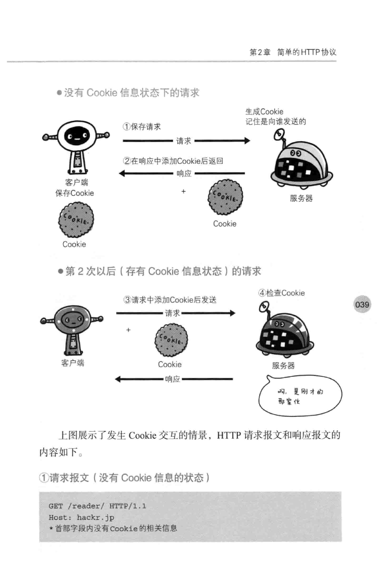

# 简单的HTTP协议
对HTTP协议结构进行讲解
## 2.1 HTTP协议用于客户端与服务端之间的通信
## 2.2 通过请求和响应的交换达成通信
## 2.3 HTTP是不保存状态的协议
即无状态协议，HTTP协议本身不具有保存之前发送过的请求或响应的功能
无状态导致业务处理变得棘手的情况增多了，比如用户登陆，需要保存用
户登陆状态。
后来引入了Cookie技术
## 2.4 请求URI定位资源
## 2.5  告知服务器意图的HTTP方法
GET,POST（传输实体主体）,PUT（传输文件）,HEAD(获取报文首部)，DELETE，OPTIONS（询问支持的方法），TRACE(追踪路径)，
CONNECT（要求用隧道协议连接代理）：CONNECT方法要求在与代理服务器通信时建立隧道，实现用隧道协议进行TCP通信。主要使用SSL(安全套接层)和TLS(传输层安全)协议把通信内容加密后通过网络隧道传输。
# 2.6 使用方法下达命令
# 2.7 持久连接节省通信量
## 2.7.1 持久连接
持久连接的好处在于减少了TCP连接的重复建立和断开所造成的额外开销，减轻了服务器端的负载。另外，减少开销的那部分时间，使HTTP请求和响应能够更早的结束，这样web页面的显示速度也就是相应提高的。
在HTTP1.1中，所有连接默认都是持久连接。
## 2.7.2 管线化
持久连接使得多数请求以管线化方式发送成为可能。以前需要等待收到响应，才能发送新请求。这样就能并行发送多个请求，不需要一个接一个的等待响应了。
# 2.8 使用Cookie的状态管理
HTTP是无状态协议，它不对之前发生过的请求和响应的状态进行管理。也就是说无法根据之前的状态进行本次的请求处理。
无状态协议也有它的优点，由于不必保存状态，自然可以减少服务器的CPU及内存资源的消耗。侧面说，正式因为HTTP协议本身是非常简单的，所以才被应用在各种场景中。
如果让服务器管理全部客户端状态会成为负担。
于是引入了cookie，Cookie技术通过在请求和响应报文中写入Cookie信息来控制客户端的状态。 
Cookie会根据从服务器端发送的响应报文内的一个叫做Set-Cookie的首部字段信息，通知客户端保存Cookie。当下次客户端再往该服务器发送请求时，客户端会自动在请求报文中加入Cookie值后发送出去。
服务器端发现客户端发送过来的Cookie后，回去检查究竟是从哪一个客户端发来的请求，然后对比服务器上的记录，最后得到之前的状态信息。

