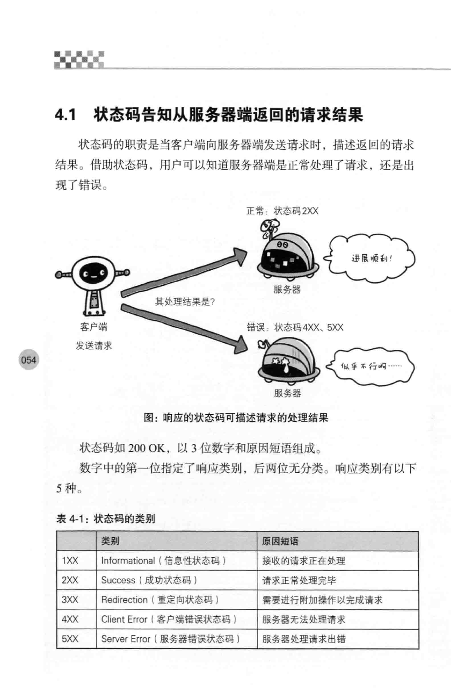

# 4 返回结果的http状态码

## 4.1 状态码告知服务器返回的请求结果



## 4.2 2xx成功

### 4.2.1 200 ok

### 4.2.2 204 no content

### 4.2.3 206 partial content

## 4.3 3xx重定向

3XX响应结果表明浏览器需要执行某些特殊的处理以正确处理请求。

### 4.3.1 301 Moved Permanently

永久性

需要进行书签引用的变更

指定URI最后忘记添加斜杠，就会产生301状体码
```
http://www.example.com/example
```

### 4.3.2 302 found

临时性

该状态码表示请求的资源已被分配了新的URI,希望用户（本次）能使用新的URI访问。

[http://blog.csdn.net/qmhball/article/details/7838989](http://blog.csdn.net/qmhball/article/details/7838989)

网址劫持    
>由于搜索引擎排名算法只是程序而不是人，在遇到302重定向的时候，并不能像人一样的去准确判定哪一个网址更适当，这就造成了网址URL劫持的可能性。也就是说，一个不道德的人在他自己的网址A做一个302重定向到你的网址B，出于某种原因， Google搜索结果所显示的仍然是网址A，但是所用的网页内容却是你的网址B上的内容，这种情况就叫做网址URL劫持。你辛辛苦苦所写的内容就这样被别人偷走了。

### 4.3.3 303 See Other

该状态码表示由于请求的对应的资源存在着另一个URI，应使用GET方法定向获取请求的资源

### 4.3.4 304 Not Modified

表示客户端发送附带条件的请求时，服务器端允许请求访问资源，但为满足条件的情况。

### 4.3.5 307 Temporary Redirect

同302，307遵循浏览器规则，不会从POST改成GET。根据浏览器也有差异

## 4.4 4xx客户端错误

### 4.4.1 400 Bad Request

表示请求报文中存在语法错误

### 4.4.2 401 Unauthorized


### 4.4.3 403 Forbidden


### 4.4.4 404 Not Found

## 4.5 5xx服务器错误

### 4.5.1 500 Internal Server Error

### 4.5.1 503 Service Unavailable 

表示服务器暂时处于超载负荷或正在进行停机维护，现在无法请求处理。