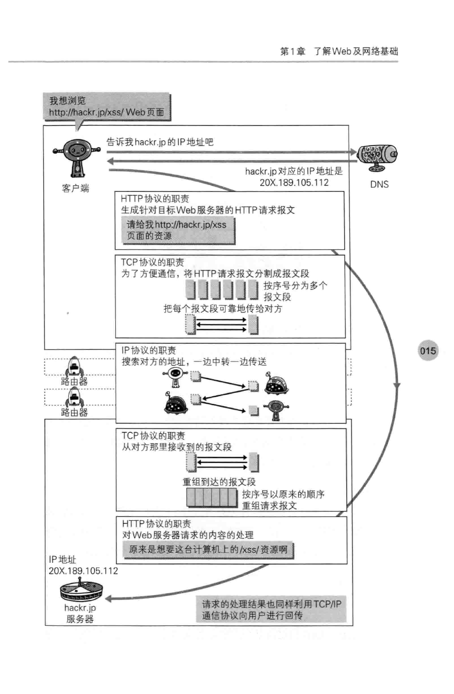

# 了解Web及网络基础
web是建立在何种技术之上的，HTTP协议是如何诞生发展的
## 1.1 使用HTTP协议访问Web
Web使用HTTP的协议作为规范，完成从客户端到服务端等一系列运作流程。而协议是指规则的约定。可以说，web是建立在HTTP协议上通信的。
## 1.2 HTTP的诞生
### 1.2.1 为知识共享而规划Web
现已提出的3项WWW构建技术：
- 把SGML（Standard Generalized Markup Language,标准通用标记语言）作为页面的文本标记语言HTML
- 作为文档传输协议的HTTP
- 指定文档所在地址的URL（Uniform Resource Locator，统一资源定位符）

### 1.2.2 Web成长时代

### 1.2.3 驻足不前的HTTP

## 1.3 协议基础 TCP/IP
HTTP属于TCP/IP协议族
### 1.3.1 TCP/IP协议族
如何探测到通信目标，由哪一边先发起通信，使用那种语言进行通信，怎样结束通信等规则都需要事先确定。不同硬件，操作系统之间的通信都需要一种规则，这种规则我们把它叫做协议。

TCP/IP是互联网相关各类协议族的统称。也有说法是两个协议...
### 1.3.2 TCP/IP的分层管理
TCP/IP协议族里最重要的一点就是分层。应用层，传输层，网络层和数据链路层
#### 应用层
应用层决定了向用户提供应用服务时通信的活动。
TCP/IP协议族内预存了各类通用的应用服务。FTP,DNS,HTTP
#### 传输层
传输层对上层应用层，提供网络连接中两台计算机之间的数据传输。

传输层有两个性质不同的协议：TCP(Trasmission Control Protocol,传输控制协议)，UDP（User Data Protocol，用户数据报协议）
#### 网络层（网络互连层）
处理在网络上流动的数据包。数据包是网络传输中最小的数据单位。该层规定了通过怎样的路径到达对方的计算机，并把数据包传送给对方。
与对方计算机之间通过多台计算机或网络设备进行运输时，网络层所起的作用就是在众多的选项内选择一条传输路线。
#### 链路层（数据链路层/网络接口层）
用来处理网络的硬件部分。包括控制操作系统，硬件的设备驱动，NIC(Network Interface Card，网络适配器，即网卡)，及光纤等物理可见部分。硬件上的范畴均在链路层的控制范围之内。
### 1.3.3 TCP/IP通信传输流
HTTP客户端 <-> TCP <-> IP <-> 网络

利用TCP/IP进行网络通信时，会通过分层顺序与对方进行通信。
发送端从应用层往下走，服务端从网络层往上走。

举例：

首先作为发送端的客户端在应用层（HTTP协议）发出一个想看某web页面的HTTP请求。
接着，为了传输方便，在传输层（TCP协议）把从应用层收到的数据（HTTP请求报文）进行分割，并在各个报文上打上标记序号及端口号后转发给网络层。
在网络层（IP协议），增加作为通信目的地的MAC地址后转发给链路层。这样一来，发往网络的通信请求就准备齐全了。
接收端的服务器在链路层接收到数据，按序往上层发送，一直到应用层，才算真正接收到由客户端发过来的HTTP请求。

发送端在层与层之间传输数据时，每经一层必定被打上一个该层所属的首部信息，反之，接受端会去掉首部。
这种把数据信息包装起来的做法称为封装。
## 1.4 与HTTP关系密切的协议：IP,TCP和DNS
### 1.4.1 负责传输的IP协议
Internet Protocol
IP协议作用是把各种数据包传送给对方。而要保证确实传送到对方那里，则需要满足各类条件。其中两个重要条件时IP地址和MAC地址。
IP地址指明节点被分配到的地址。MAC地址是指网卡所属的固定地址，IP地址可以和MAC地址配对，IP地址可变换，但MAC地址基本不会改变。 

使用ARP协议凭借MAC地址进行通信，IP间的通信依赖MAC地址。
### 1.4.2 确保可靠性的TCP协议
TCP属于传输层，提供可靠的字节流服务。
字节流服务：为传输方便，将大块数据分割成以报文段为单位的数据包进行管理。换句话说，就是TCP为了更容易传输大数据才把数据分割开，也能确认数据最终是否送达到对方。
三次握手：发送端发送一个带SYN标志的数据包给对方，接收端收到后回传一个带有SYN/ACK标志的数据包以示传到确认信息。最后发送端发送一个带有ACK标志的数据包，代表握手成功。
## 1.5 负责域名解析的DNS服务
提供域名到IP地址的解析服务
## 1.6 各种协议与HTTP协议的关系

## 1.7 URI和URL
URI(统一资源标志符)URL(统一资源定位符)
URI就是由某个协议方案表示的资源的定位标识符。协议方案就是访问资源所使用的协议类型的名称。
URI用字符串标识某一互联网资源，而URL表示资源的地点。URL示URI的子集。

