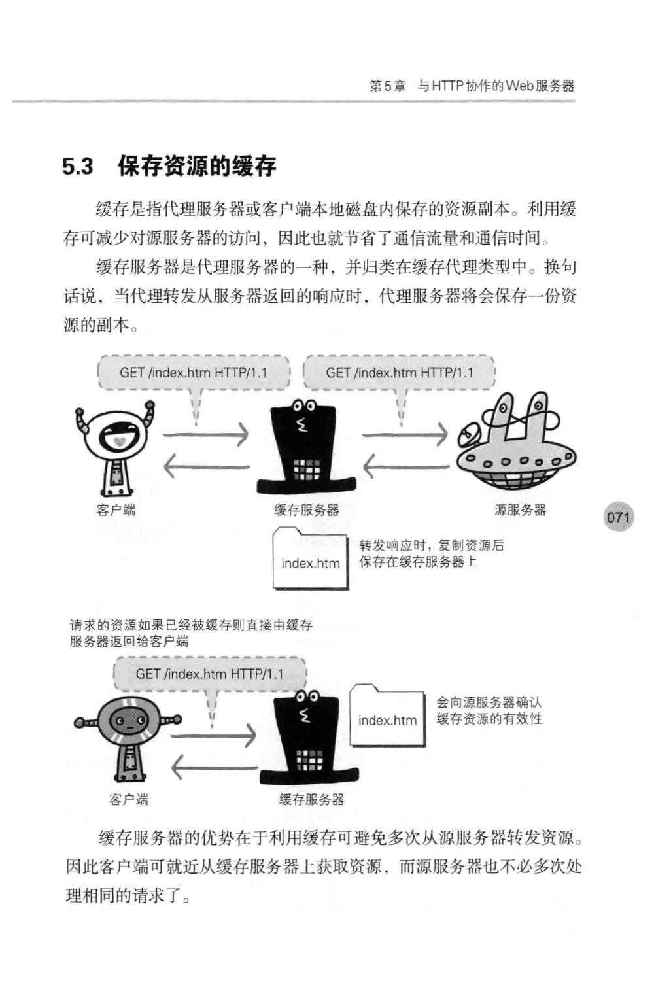

# 5 与HTTP协作的Web服务器

一台Web服务器可以搭建多个独立域名的Web网站，也可以作为通信路径上的中转站提升传输效率。

## 5.1 用单台虚拟主机实现多个域名

在相同的IP地址下，由于虚拟主机可以寄存多个不同的主机名和域名的网站，因此在发送HTTP请求时，必须在Host首部内完整指定主机名或域名上的URI

## 5.2 通信数据转发程序：代理，网关，隧道

这些应用程序和服务器可以将请求转发给通信线路上的下一站服务器，并能能够接受那台服务器发送的响应再转发给i客户端

代理：

带有转发功能的程序，扮演“中间人”的角色，接收由客户端发送的请求并转发给服务器，同时也接收服务器返回的响应并转发给客户端。

网关：

### 5.2.1 代理

代理不改变请求URI

通过代理服务器转发请求或响应时，会追加写入Via首部信息

通过设置组织内部的代理服务器可以做到针对特定URI访问的控制

使用代理服务器的理由：利用缓存技术，减少网络带宽的流量，访问控制，获取日志

### 5.2.2 网关

网关的工作机制和代理十分相似，利用网关可以由HTTP请求转化为其他协议通信

### 5.2.3 隧道

通过隧道的传输，可以和远距离的服务器安全通信，隧道本身的透明的，客户端不用在意隧道的存在

## 5.3 保存资源的缓存

缓存是指代理服务器或客户端本地磁盘内保存的资源副本，利用缓存可以减少对源服务器的访问，因此也就节省了通信流量和通信时间。

缓存服务器是代理服务器中的一种，并归类在缓存代理类型中。

### 5.3.1 缓存的有效期

确认资源的有效性

### 5.3.2 客户端的缓存

确认资源的有效性